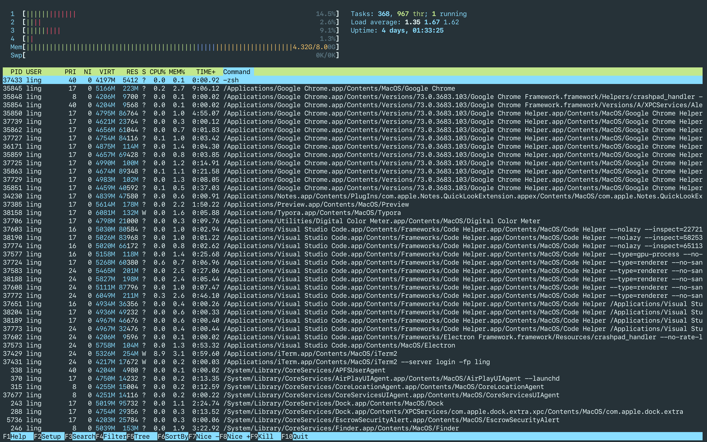
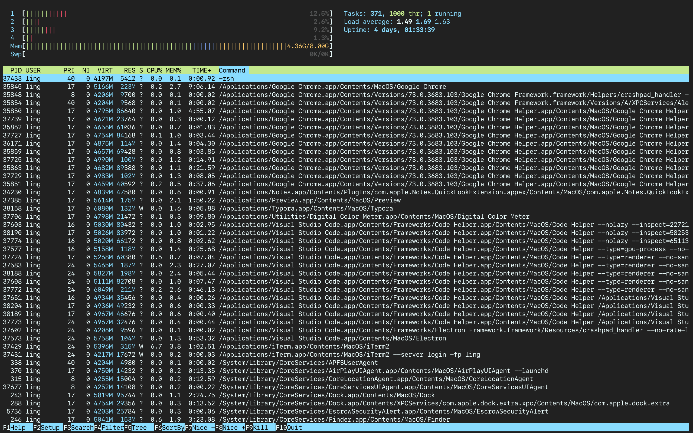

# iterm2-equinusocio-material

## screenshot

## Other

If using vim you are, you may like to try this theme: [chuling/vim-equinusocio-material](https://github.com/chuling/vim-equinusocio-material.git).

## License

[Apache-2.0](LICENSE)
